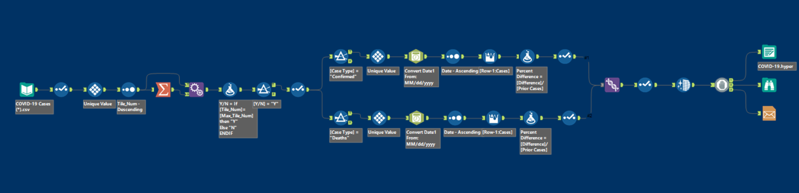
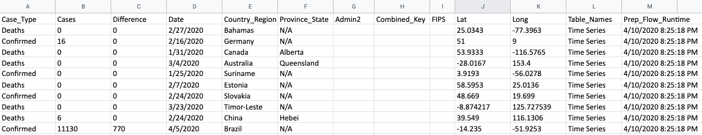
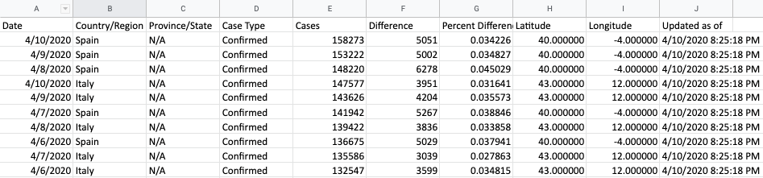

# COVID_alteryx

# Simple workflow build that does the following:
  1. Dynamically selects the latest COVID data download
  2. Cleans and manipulates the data
  3. Unions the newest data to the previous files and calculates the increase/decrease percentages
  4. Outputs a .hyper file and emails me when the workflow is completed
  
Sample input data

Sample output data

